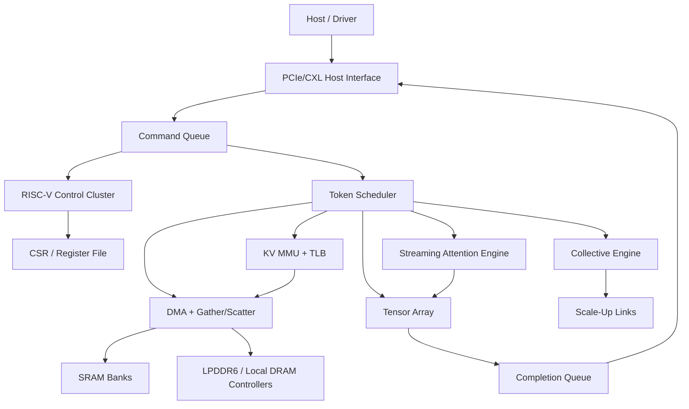
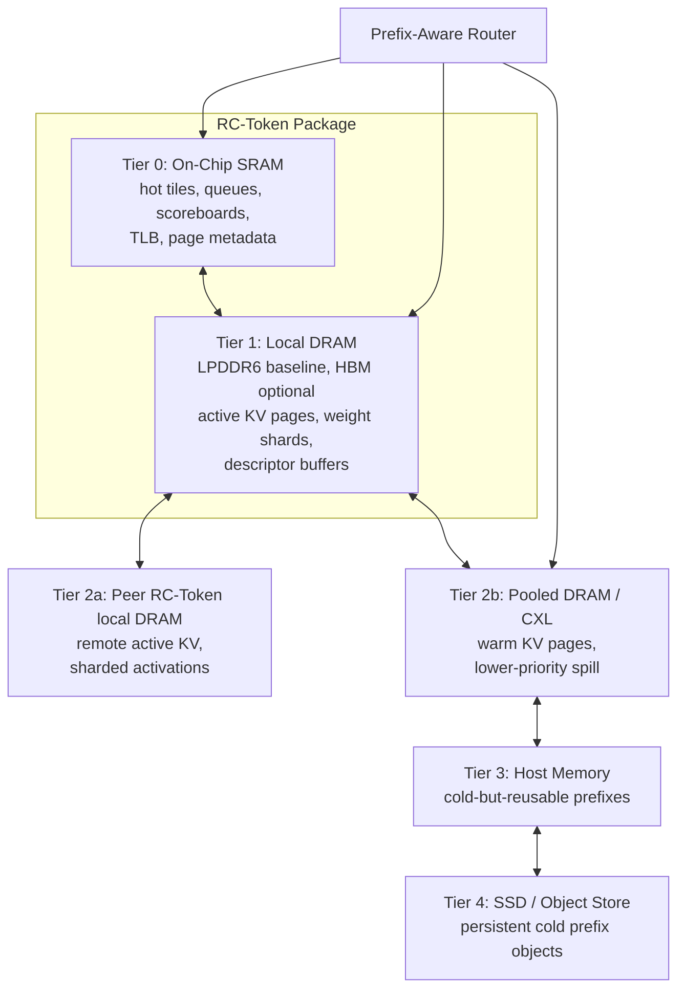

# Recursive Compute Inference ASIC Architecture

This document describes the first target architecture for an inference-only ASIC and system fabric optimized for agentic LLM workloads in the 500B to 5T parameter range.

The design center is coding-agent inference: very large prompts, heavy prefix reuse, long-lived sessions, and latency-sensitive decode. The architecture therefore optimizes KV-cache locality and deterministic token generation before raw training-style throughput.

## 1. System View

Recursive Compute Inference Fabric, RCIF, is a rack-scale system built from memory-rich token-generation ASIC packages plus a runtime that routes requests by prefix/KV locality.

The first implementation focuses on **RC-Token**, the Token Engine ASIC. Context ingestion can initially run on GPUs or a software simulator. RC-Token owns decode, paged KV access, command scheduling, and later tensor/attention engines.

The first silicon baseline is now **LPDDR6-first**, not HBM-first. The product thesis is that decode inference should buy cheap capacity, enough sustained bandwidth, deterministic scheduling, and board-level ports before buying excess FLOPs or expensive packaging. HBM remains a possible premium variant, but RTL and simulator interfaces should name the tier as local DRAM unless the block is truly HBM-specific.

Naming used in this architecture:

- **Context Engine**, or **RC-Context**: the prefill-oriented role that ingests large prompts and creates KV pages.
- **Token Engine**, or **RC-Token**: the decode-oriented ASIC role that reuses KV pages and generates output tokens with low jitter.

## 2. Token Engine Goals

Primary goals:

- Minimize TPOT and p95/p99 jitter for decode.
- Reuse large stable prefixes across agent turns.
- Make KV cache a hardware-visible virtual memory object.
- Keep firmware out of the per-token critical path.
- Balance compute against local DRAM bandwidth instead of provisioning training-class FLOPs.
- Support tensor/expert parallel communication without host involvement, while keeping collectives within a measured TPOT budget.

Non-goals for first silicon:

- Training support.
- General-purpose GPU compatibility.
- Monolithic support for a full 5T dense model in one package.
- Assuming every layer can afford dense tensor-parallel all-reduce over PCIe-class links.
- High-risk analog compute.

## 3. Token Engine Block Diagram

## 4. Control Plane

The control plane uses small RISC-V cores for firmware, queue management, page faults, telemetry, and debug. RISC-V is not the main inference datapath.

The first RTL boundary is intentionally simple:

- Host submits command descriptors through a ready/valid command interface.
- A command queue absorbs short bursts and decouples host timing from scheduler timing.
- A scheduler stub decodes simple commands and emits completions.
- Later scheduler versions will issue DMA, KV, attention, tensor, and collective descriptors.

Current command opcodes:

| Opcode | Name | Behavior |
| --- | --- | --- |
| `0x0000` | NOP | Complete with status `0` and result `0`. |
| `0x0001` | ECHO | Complete with status `0` and result equal to payload. |
| `0x0010` | GET_COUNTER | Return a scheduler counter selected by payload byte 0. |
| `0x0020` | KV_MAP | Install or update a virtual KV page mapping. |
| `0x0021` | KV_TRANSLATE | Translate a virtual KV page through the reference KV MMU. |
| `0x0022` | KV_GET_FAULT | Pop the oldest queued KV page-fault record. |
| `0x0030` | DMA_COPY | Validate and complete a DMA copy descriptor through the DMA skeleton. |
| `0x0031` | DMA_INDEX_WRITE | Program a physical page into the gather index table. |
| `0x0032` | DMA_GATHER | Copy a non-contiguous page list into contiguous destination pages. |
| `0x0033` | DMA_ECC_INJECT | Verification hook that corrupts stored page parity. |
| `0x0040` | ATTN_QK_DOT | Execute the first four-lane signed-int8 Q·K tile. |
| other | unsupported | Complete with status `1` and result containing opcode. |

Current error status:

| Status | Meaning |
| --- | --- |
| `0` | Success. |
| `1` | Unsupported opcode. |
| `2` | Unsupported command flags. |
| `3` | Unsupported counter selector. |
| `4` | KV translation miss. |
| `5` | KV MMU table full. |
| `6` | Reserved KV payload bits were nonzero. |
| `7` | DMA descriptor length was zero. |
| `8` | Reserved DMA payload bits were nonzero. |
| `9` | DMA descriptor page range exceeded the current gather/scatter SRAM model. |
| `10` | KV fault queue was empty. |
| `11` | DMA gather list contained an unprogrammed entry. |
| `12` | DMA detected a page parity mismatch. |

Current counter selectors:

| Selector | Name | Meaning |
| --- | --- | --- |
| `0` | accepted | Commands accepted by the scheduler. |
| `1` | completed | Completions handshaked by the host. |
| `2` | errors | Commands that completed with nonzero status. |
| `3` | fault overflows | Fault records overwritten because firmware did not drain the queue. |

Current KV command payload:

| Bits | Field | Meaning |
| --- | --- | --- |
| `[15:0]` | virtual page | Virtual KV page id. |
| `[31:16]` | physical page | Physical page id for `KV_MAP`; ignored for `KV_TRANSLATE`. |
| `[35:32]` | tier | Physical memory tier. |
| `[39:36]` | format | KV payload format tag. |
| `[63:40]` | reserved | Must be zero in the current RTL. |

Current DMA command payload:

| Bits | Field | Meaning |
| --- | --- | --- |
| `[15:0]` | source page | Source page id for the skeleton copy descriptor. |
| `[31:16]` | destination page | Destination page id for the skeleton copy descriptor. |
| `[47:32]` | length | Transfer length in descriptor units; zero is rejected. |
| `[63:48]` | reserved | Must be zero in the current RTL. |

Successful `DMA_COPY` commands now run through the first `rcif_gather_scatter`
data-path boundary. The current model copies one word per page between a tiny
page-backed SRAM array and returns an XOR checksum of the copied words as the
completion result. This is a deterministic Verilator-visible prototype for
gather/scatter completion behavior, not a final local DRAM or AXI memory mover.

Accepted DMA descriptors pass through a four-entry descriptor-fetch FIFO before
gather/scatter execution. This creates the stable queued boundary needed for a
future SRAM/host descriptor reader while retaining exactly-once completion and
backpressure behavior in the current single-command scheduler.

The gather/scatter prototype also has a programmable 256-entry page-index
table. Indirect descriptors validate every list entry before modifying the
destination and then gather non-contiguous source pages into consecutive SRAM
pages. This models the page-list access pattern needed by paged attention and
MoE expert/activation movement.

Each valid SRAM-model page carries even parity. A descriptor scans its complete
source list for parity failures before the first destination write, so injected
errors fail deterministically without partial copies. The injection opcode is a
DV hook; production error injection will move behind privileged diagnostics.

The KV MMU now separates the TLB from its SRAM-resident reference page table.
`KV_MAP` updates the page table and warms the bounded TLB. A translation that
misses in the TLB issues a page walk, refills the TLB on a hit, and returns the
existing KV-miss status when no page-table entry exists. The small TLB uses
deterministic round-robin replacement so page-walk behavior is reproducible in
simulation.

Unmapped KV translations also enqueue a firmware-visible fault record containing
the cause, original request id, and virtual page. `KV_GET_FAULT` drains these
records in FIFO order. A full queue overwrites its oldest record, retains the
newest fault, and increments a visible overflow counter so fault traffic cannot
deadlock the single-command smoke scheduler.

## 5. Decode Dataflow

The target decode path for one generated token is:

1. Router chooses an RC-Token locality domain based on prefix hash and KV residency.
2. Host submits a token-step graph descriptor.
3. Scheduler prefetches KV pages and weight tiles.
4. KV MMU translates virtual KV pages to physical tiers.
5. DMA gathers K/V pages into SRAM tiles.
6. Streaming attention computes online softmax and V reduction.
7. Tensor array runs projection and MLP operations.
8. Collective engine exchanges partials for tensor/expert parallel layers.
9. Completion queue reports token output or graph completion.

The eventual token scheduler must be deterministic for a fixed descriptor stream. That property is central to low jitter and reproducible verification.

The Phase 4 standalone attention engine extends the command-level QK bring-up
path with a programmable non-contiguous page reader, dynamic MHA/GQA/MQA head
mapping, composable explicit/window/sink masks, online fixed-point softmax, and
V reduction. It remains outside the compact 64-bit smoke command ABI because a
complete attention descriptor requires query, page-list, head, context, and
mask state. A later scheduler phase will bind that engine interface to frozen
multiword descriptors and the Phase 3 MMU/DMA request path.

The Phase 5 standalone tensor engine follows the same integration pattern. A
DMA-facing programming boundary loads four packed rows and their zero-point,
scale, bias, and normalization metadata. A request then executes deterministic
INT8/INT4 GEMV, saturation, activation, and optional integer RMSNorm while the
ready/valid result boundary holds all data and status stable under
backpressure.

The Phase 6 token scheduler maps fixed 128-bit graph descriptors onto the DMA,
paged-attention, and tensor boundaries. An eight-bit dependency scoreboard
permits descriptor storage order to differ from execution order. The bounded
prototype executes one engine node at a time, chooses pending requests by
priority at graph boundaries, and retains FIFO order within a priority. A
completion FIFO absorbs host backpressure, while a cycle-independent issue and
finish trace makes repeated execution directly comparable. The bounded default
allocates 6,400 cycles per graph and guarantees accepted priority-3 requests
retire internally within 32,000 cycles; sticky runtime monitors cover both the
per-graph service assumption and the queue-derived latency bound. The full
descriptor contract is in `docs/specs/token_graph_descriptor.md`.

The Phase 10 reduced FPGA shell preserves this graph boundary and adds an AXI4
external-memory reader for a vendor DDR/HBM controller. Its pre-board backend
uses the same authenticated runtime path, executes a four-token attention plus
INT8 projection graph, and accounts KV residency, host-tier faults, migrations,
and cycles. The portable contract and physical-board closure gates are frozen
in `docs/specs/fpga_emulation.md`.

## 6. KV Memory Model

KV cache is represented as virtual pages. Page metadata includes:

- Model id and weight revision.
- Layer id.
- Head group id.
- Token page index.
- Precision/compression format.
- Physical tier.
- Tenant/security context.
- Prefix hash.
- Reference count.

The hardware must support:

- TLB lookup for KV pages.
- Page faults to firmware/runtime.
- Read-only shared prefix pages.
- Reference-counted aliases for reused prefixes.
- Compression tags so the attention engine knows how to decode each page.

## 7. Memory Hierarchy

Initial hierarchy:

- SRAM: hot tiles, metadata, queues, scoreboards, small reductions.
- Local DRAM: LPDDR6 baseline for local weights, active KV, descriptor buffers; HBM optional for premium variants.
- Peer/package fabric: remote KV or sharded activations.
- Host/CXL/pooled memory: warm pages and lower-priority spill.
- SSD/object store: cold prefix persistence managed by software.

The simulator tracks KV bytes per token, local/remote/cold bytes, and weight bytes per token. RTL will gradually expose the same counters.

### 7.1 First-Silicon Memory and Compute Target

The baseline RC-Token package should target many LPDDR6 channels around the die edge. A planning point is 24 channels, 576 data pins, and roughly 1 TB/s raw local DRAM bandwidth at top-bin LPDDR6 signaling. Simulator and floorplan work must derate this to sustained bandwidth after command overhead, refresh, ECC, controller efficiency, and workload access patterns.

The tensor array should be sized from the sustained local-memory roofline. For batch-64 FP4 decode, an ideal weight stream delivers about 256 FLOPs per byte, so a 0.7-1.0 TB/s sustained memory system points to roughly 180-260 TFLOP/s useful FP4 compute. The planning envelope is therefore 250-350 TFLOP/s FP4 per RC-Token, with larger arrays treated as a simulator-proven exception rather than the default.

This target intentionally trades HBM/CoWoS and leading-edge logic density for:

- larger cheap local weight/KV capacity;
- simpler organic-package economics;
- enough edge budget for LPDDR PHYs and scale-up links;
- lower scheduling jitter from local KV residency and deterministic DMA;
- a fabric budget sized around activations, KV movement, metadata, and MoE traffic, not training gradients.

### 7.2 Memory Hierarchy Diagram

### 7.3 On-Chip SRAM Estimate

The first RC-Token target should budget **512 MB of on-chip SRAM** as the baseline, with a practical exploration range of **256 MB to 1 GB** depending on process, die area, SRAM compiler options, and how much is moved into separate SRAM chiplets.

This SRAM is not meant to hold full model weights or full long-context KV. Its job is to absorb latency-sensitive working sets:

| SRAM use | Baseline budget |
| --- | ---: |
| Attention K/V streaming tile buffers | 96 MB |
| Tensor/activation tile buffers | 96 MB |
| KV TLB, page-walk cache, page metadata cache | 64 MB |
| Command, completion, DMA, and fault queues | 16 MB |
| Scheduler scoreboards and token graph state | 32 MB |
| Collective/reduction scratch | 64 MB |
| Firmware-visible scratch and diagnostics | 32 MB |
| ECC, banking overhead, spare rows, guard band | 112 MB |
| **Total baseline** | **512 MB** |

Sizing rationale:

- A 1M-token full KV cache is far too large for on-chip SRAM, so SRAM should cache the hot decode window, metadata, and reusable tiles rather than act as the full KV store.
- KV metadata can become hot under prefix sharing. Keeping the TLB and page metadata cache on chip is more valuable than trying to pin all KV payloads.
- Attention and tensor engines need independent double-buffered SRAM regions so DMA, attention, and tensor work can overlap.
- A 256 MB design is plausible for a smaller first prototype, but it will stress buffering and metadata hit rate.
- A 1 GB design gives more margin for long-context windows and more tensor/attention overlap, but may push die area, yield, timing, and power too hard for first silicon unless implemented with SRAM chiplets.

Early RTL should expose SRAM as banked memories with parameters, not hard-code the 512 MB target. The Verilator model can use tiny bank depths while preserving the same interfaces.

## 8. Compute Datapath

Compute engines are staged in this order:

1. Scheduler and queues.
2. KV MMU and DMA.
3. Streaming attention.
4. Tensor array.
5. Collective engine.

The first real compute target is streaming decode attention over paged KV. The tensor array follows once descriptor formats and KV reads are stable.

The tensor array is a bandwidth-balanced decode array, not a maximal FLOP island. It should support FP8/FP4/INT4 weight paths with higher-precision accumulation, but the area budget should stop once sustained local DRAM bandwidth, SRAM reuse, and collective stalls become the limiting factors. Simulator reports must show memory time, compute time, and collective time separately before increasing array size.

## 9. Scale-Out

Large models require model parallelism:

- Tensor parallel for dense projections only when the collective budget closes.
- Expert parallel for MoE experts.
- Pipeline parallel only when the latency tradeoff is acceptable.
- Replicated or semi-replicated small hot layers when memory capacity allows it and it removes per-token collectives.

The collective engine should eventually provide:

- AllReduce.
- AllGather.
- ReduceScatter.
- Broadcast.
- AllToAll.

The runtime owns topology-aware placement so repeated agent sessions stay near their KV. First-silicon mesh assumptions should be conservative: a full 8-chip group can be modeled as seven peer ports per chip, but per-neighbor bandwidth and latency must be explicit simulator inputs. The collective engine is optimized first for small activation exchange, KV migration, MoE routing, and metadata broadcasts. Dense all-reduce on every layer is a risk to be proven, not a baseline assumption.

## 10. Verification Strategy

The default verification path runs on Modal CPU workers:

- Python golden tests.
- Verilator lint.
- Verilator C++ smoke tests.
- Later random descriptor tests.

The first Verilator smoke test exercises:

- reset behavior;
- command ready/valid;
- NOP completion;
- ECHO completion;
- unsupported opcode handling;
- unsupported flag handling;
- completion backpressure.
- command FIFO burst ordering;
- scheduler counters;
- KV map, translate, miss, remap, full-table, reserved-bit, page-walk refill,
  and queued fault-report behavior.
- DMA descriptor accept, zero-length fault, and reserved-bit fault behavior.

## 11. Implementation Milestones

Milestone A, current:

- Modal CPU automation.
- Top-level command/completion shell.
- Multi-entry command queue module.
- Scheduler stub module with basic counters.
- Verilator smoke coverage for basic protocol, queue burst, backpressure, and counter behavior.

Milestone B:

- Descriptor package and register map.
- Multi-entry queues.
- Performance counters.
- Fault/event queue.

Milestone B control-plane software status: complete for the Phase 8 bounded
simulation. The frozen MMIO/ring ABI has freestanding RV64 firmware, secure boot
and anti-rollback policy, KV fault replay, a host driver prototype, and
end-to-end DV. Instruction-accurate core and operating-system integration are
later platform milestones.

Milestone C:

- KV MMU reference RTL with a reusable TLB and map/translate command support.
- Page table smoke coverage through Verilator.
- DMA descriptor skeleton with smoke coverage.

Milestone D:

- Paged attention RTL slice.
- Golden-model comparison tests.
- Randomized page layout tests.

Milestone E, bounded full-chip verification:

- Assertion-enabled top-level command/completion checking.
- Deterministic random reset and backpressure regression.
- Independent security and memory-safety invariant monitors.
- Agentic descriptor-trace replay and complete required cross coverage.
- 90% minimum Verilator line coverage with explicit production signoff gates.
