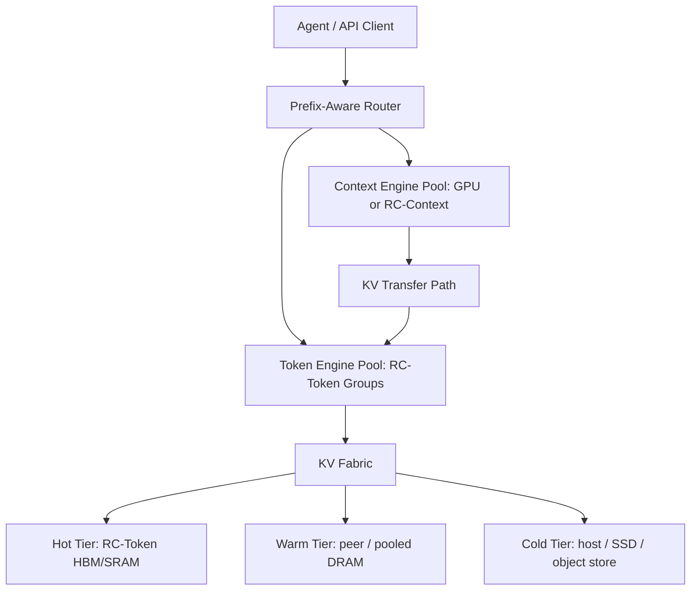
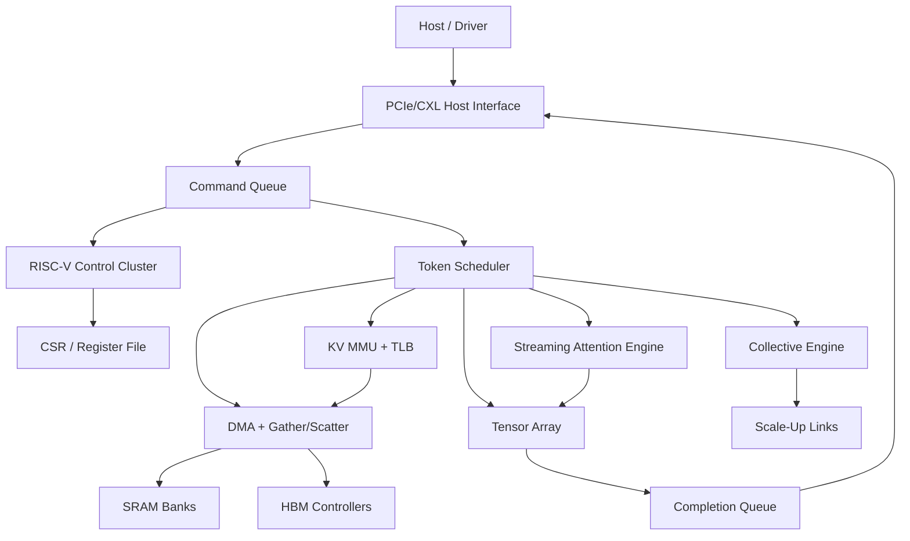
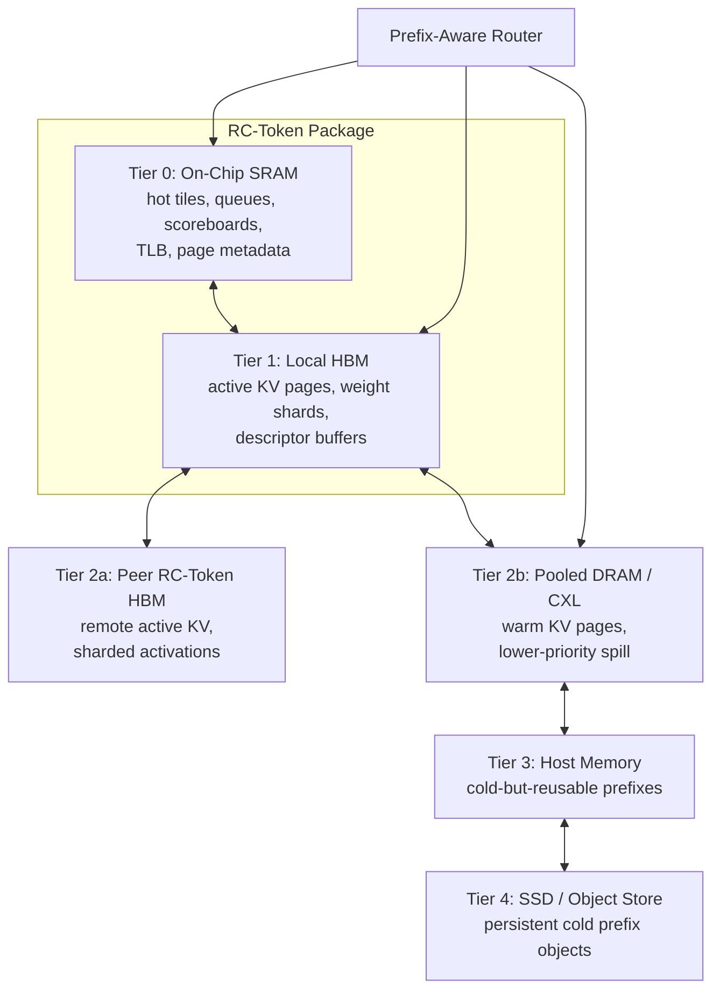

# Recursive Compute Inference ASIC Architecture

This document describes the first target architecture for an inference-only ASIC and system fabric optimized for agentic LLM workloads in the 500B to 5T parameter range.

The design center is coding-agent inference: very large prompts, heavy prefix reuse, long-lived sessions, and latency-sensitive decode. The architecture therefore optimizes KV-cache locality and deterministic token generation before raw training-style throughput.

## 1. System View

Recursive Compute Inference Fabric, RCIF, is a rack-scale system built from token-generation ASIC packages plus a runtime that routes requests by prefix/KV locality.

The first implementation focuses on **RC-Token**, the Token Engine ASIC. Context ingestion can initially run on GPUs or a software simulator. RC-Token owns decode, paged KV access, command scheduling, and later tensor/attention engines.

Naming used in this architecture:

- **Context Engine**, or **RC-Context**: the prefill-oriented role that ingests large prompts and creates KV pages.
- **Token Engine**, or **RC-Token**: the decode-oriented ASIC role that reuses KV pages and generates output tokens with low jitter.

## 2. Token Engine Goals

Primary goals:

- Minimize TPOT and p95/p99 jitter for decode.
- Reuse large stable prefixes across agent turns.
- Make KV cache a hardware-visible virtual memory object.
- Keep firmware out of the per-token critical path.
- Support tensor/expert parallel communication without host involvement.

Non-goals for first silicon:

- Training support.
- General-purpose GPU compatibility.
- Monolithic support for a full 5T dense model in one package.
- High-risk analog compute.

## 3. Token Engine Block Diagram

## 4. Control Plane

The control plane uses small RISC-V cores for firmware, queue management, page faults, telemetry, and debug. RISC-V is not the main inference datapath.

The first RTL boundary is intentionally simple:

- Host submits command descriptors through a ready/valid command interface.
- A command queue absorbs short bursts and decouples host timing from scheduler timing.
- A scheduler stub decodes simple commands and emits completions.
- Later scheduler versions will issue DMA, KV, attention, tensor, and collective descriptors.

Current command opcodes:

| Opcode | Name | Behavior |
| --- | --- | --- |
| `0x0000` | NOP | Complete with status `0` and result `0`. |
| `0x0001` | ECHO | Complete with status `0` and result equal to payload. |
| `0x0010` | GET_COUNTER | Return a scheduler counter selected by payload byte 0. |
| `0x0020` | KV_MAP | Install or update a virtual KV page mapping. |
| `0x0021` | KV_TRANSLATE | Translate a virtual KV page through the reference KV MMU. |
| `0x0030` | DMA_COPY | Validate and complete a DMA copy descriptor through the DMA skeleton. |
| other | unsupported | Complete with status `1` and result containing opcode. |

Current error status:

| Status | Meaning |
| --- | --- |
| `0` | Success. |
| `1` | Unsupported opcode. |
| `2` | Unsupported command flags. |
| `3` | Unsupported counter selector. |
| `4` | KV translation miss. |
| `5` | KV MMU table full. |
| `6` | Reserved KV payload bits were nonzero. |
| `7` | DMA descriptor length was zero. |
| `8` | Reserved DMA payload bits were nonzero. |
| `9` | DMA descriptor page range exceeded the current gather/scatter SRAM model. |

Current counter selectors:

| Selector | Name | Meaning |
| --- | --- | --- |
| `0` | accepted | Commands accepted by the scheduler. |
| `1` | completed | Completions handshaked by the host. |
| `2` | errors | Commands that completed with nonzero status. |

Current KV command payload:

| Bits | Field | Meaning |
| --- | --- | --- |
| `[15:0]` | virtual page | Virtual KV page id. |
| `[31:16]` | physical page | Physical page id for `KV_MAP`; ignored for `KV_TRANSLATE`. |
| `[35:32]` | tier | Physical memory tier. |
| `[39:36]` | format | KV payload format tag. |
| `[63:40]` | reserved | Must be zero in the current RTL. |

Current DMA command payload:

| Bits | Field | Meaning |
| --- | --- | --- |
| `[15:0]` | source page | Source page id for the skeleton copy descriptor. |
| `[31:16]` | destination page | Destination page id for the skeleton copy descriptor. |
| `[47:32]` | length | Transfer length in descriptor units; zero is rejected. |
| `[63:48]` | reserved | Must be zero in the current RTL. |

Successful `DMA_COPY` commands now run through the first `rcif_gather_scatter`
data-path boundary. The current model copies one word per page between a tiny
page-backed SRAM array and returns an XOR checksum of the copied words as the
completion result. This is a deterministic Verilator-visible prototype for
gather/scatter completion behavior, not a final HBM or AXI memory mover.

## 5. Decode Dataflow

The target decode path for one generated token is:

1. Router chooses an RC-Token locality domain based on prefix hash and KV residency.
2. Host submits a token-step graph descriptor.
3. Scheduler prefetches KV pages and weight tiles.
4. KV MMU translates virtual KV pages to physical tiers.
5. DMA gathers K/V pages into SRAM tiles.
6. Streaming attention computes online softmax and V reduction.
7. Tensor array runs projection and MLP operations.
8. Collective engine exchanges partials for tensor/expert parallel layers.
9. Completion queue reports token output or graph completion.

The eventual token scheduler must be deterministic for a fixed descriptor stream. That property is central to low jitter and reproducible verification.

## 6. KV Memory Model

KV cache is represented as virtual pages. Page metadata includes:

- Model id and weight revision.
- Layer id.
- Head group id.
- Token page index.
- Precision/compression format.
- Physical tier.
- Tenant/security context.
- Prefix hash.
- Reference count.

The hardware must support:

- TLB lookup for KV pages.
- Page faults to firmware/runtime.
- Read-only shared prefix pages.
- Reference-counted aliases for reused prefixes.
- Compression tags so the attention engine knows how to decode each page.

## 7. Memory Hierarchy

Initial hierarchy:

- SRAM: hot tiles, metadata, queues, scoreboards, small reductions.
- HBM: local weights, active KV, descriptor buffers.
- Peer/package fabric: remote KV or sharded activations.
- Host/CXL/pooled memory: warm pages and lower-priority spill.
- SSD/object store: cold prefix persistence managed by software.

The simulator tracks KV bytes per token, local/remote/cold bytes, and weight bytes per token. RTL will gradually expose the same counters.

### 7.1 Memory Hierarchy Diagram

### 7.2 On-Chip SRAM Estimate

The first RC-Token target should budget **512 MB of on-chip SRAM** as the baseline, with a practical exploration range of **256 MB to 1 GB** depending on process, die area, SRAM compiler options, and how much is moved into separate SRAM chiplets.

This SRAM is not meant to hold full model weights or full long-context KV. Its job is to absorb latency-sensitive working sets:

| SRAM use | Baseline budget |
| --- | ---: |
| Attention K/V streaming tile buffers | 96 MB |
| Tensor/activation tile buffers | 96 MB |
| KV TLB, page-walk cache, page metadata cache | 64 MB |
| Command, completion, DMA, and fault queues | 16 MB |
| Scheduler scoreboards and token graph state | 32 MB |
| Collective/reduction scratch | 64 MB |
| Firmware-visible scratch and diagnostics | 32 MB |
| ECC, banking overhead, spare rows, guard band | 112 MB |
| **Total baseline** | **512 MB** |

Sizing rationale:

- A 1M-token full KV cache is far too large for on-chip SRAM, so SRAM should cache the hot decode window, metadata, and reusable tiles rather than act as the full KV store.
- KV metadata can become hot under prefix sharing. Keeping the TLB and page metadata cache on chip is more valuable than trying to pin all KV payloads.
- Attention and tensor engines need independent double-buffered SRAM regions so DMA, attention, and tensor work can overlap.
- A 256 MB design is plausible for a smaller first prototype, but it will stress buffering and metadata hit rate.
- A 1 GB design gives more margin for long-context windows and more tensor/attention overlap, but may push die area, yield, timing, and power too hard for first silicon unless implemented with SRAM chiplets.

Early RTL should expose SRAM as banked memories with parameters, not hard-code the 512 MB target. The Verilator model can use tiny bank depths while preserving the same interfaces.

## 8. Compute Datapath

Compute engines are staged in this order:

1. Scheduler and queues.
2. KV MMU and DMA.
3. Streaming attention.
4. Tensor array.
5. Collective engine.

The first real compute target is streaming decode attention over paged KV. The tensor array follows once descriptor formats and KV reads are stable.

## 9. Scale-Out

Large models require model parallelism:

- Tensor parallel for dense projections.
- Expert parallel for MoE experts.
- Pipeline parallel only when the latency tradeoff is acceptable.

The collective engine should eventually provide:

- AllReduce.
- AllGather.
- ReduceScatter.
- Broadcast.
- AllToAll.

The runtime owns topology-aware placement so repeated agent sessions stay near their KV.

## 10. Verification Strategy

The default verification path runs on Modal CPU workers:

- Python golden tests.
- Verilator lint.
- Verilator C++ smoke tests.
- Later random descriptor tests.

The first Verilator smoke test exercises:

- reset behavior;
- command ready/valid;
- NOP completion;
- ECHO completion;
- unsupported opcode handling;
- unsupported flag handling;
- completion backpressure.
- command FIFO burst ordering;
- scheduler counters;
- KV map, translate, miss, remap, full-table, and reserved-bit behavior.
- DMA descriptor accept, zero-length fault, and reserved-bit fault behavior.

## 11. Implementation Milestones

Milestone A, current:

- Modal CPU automation.
- Top-level command/completion shell.
- Multi-entry command queue module.
- Scheduler stub module with basic counters.
- Verilator smoke coverage for basic protocol, queue burst, backpressure, and counter behavior.

Milestone B:

- Descriptor package and register map.
- Multi-entry queues.
- Performance counters.
- Fault/event queue.

Milestone C:

- KV MMU reference RTL with a reusable TLB and map/translate command support.
- Page table smoke coverage through Verilator.
- DMA descriptor skeleton with smoke coverage.

Milestone D:

- Paged attention RTL slice.
- Golden-model comparison tests.
- Randomized page layout tests.
