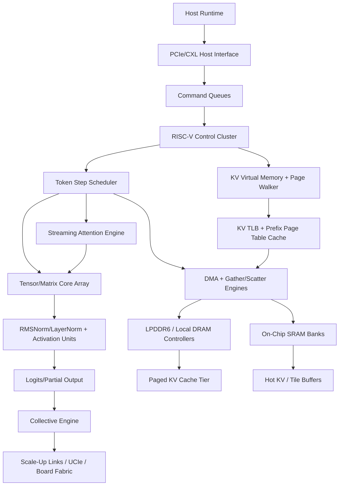

# Agentic LLM Inference ASIC Plan

This plan turns the source PDF, "Custom ASIC and System Architectures for 1T-10T LLM Inference", into a concrete hardware and verification roadmap for an inference-only accelerator aimed at 500B to 5T parameter agentic workloads, especially coding agents with very large repeated prompts.

The recommended product is not a single monolithic "one chip runs 5T" device. It is a rack-scale inference system built from memory-rich decode ASICs, a RISC-V control plane, hardware KV-cache paging, and a compiler/runtime that treats prompt reuse as a first-order scheduling signal. The first-silicon baseline is now LPDDR6-first rather than HBM-first: buy cheap local capacity, enough sustained bandwidth, deterministic scheduling, and board-level ports before buying excess FLOPs or expensive packaging.

## 1. Product Thesis

Agentic coding workloads differ from chat workloads:

- They reuse large, stable prefixes: repository context, tool instructions, coding guidelines, issue context, and prior thread state often remain unchanged across many turns.
- They have long input sequences and moderate output sequences: prefill is expensive, but the business-critical loop is usually low-latency decode with cached context.
- They need strict tail latency: tool-call agents feel slow when TTFT or TPOT has high jitter.
- They benefit from deterministic orchestration: the same project context can be routed to the same KV locality domain.

Therefore the ASIC should optimize the following, in priority order:

1. KV-cache reuse, movement, compression, and eviction.
2. Decode TPOT and jitter at small to medium batch sizes.
3. Sustained local-memory bandwidth and capacity per dollar.
4. Topology-aware tensor parallel, expert parallel, and KV movement with explicit collective budgets.
5. Prefill throughput for very long prompts.
6. Low-precision inference formats that preserve coding benchmark quality.

The architecture borrows lessons from the PDF's vendor survey:

- Cerebras: keep data near compute and avoid conventional off-chip decode bandwidth walls.
- NVIDIA: disaggregate prefill/decode, use paged/quantized KV, and scale with topology-aware orchestration.
- Groq: deterministic, compiler-scheduled pipelines reduce jitter.
- d-Matrix: in-memory/near-memory decode and topology-aware collectives are valuable for token generation.
- Etched-style specialization: useful, but risky if too transformer-only and not sufficiently programmable.

## 2. System Architecture

### 2.1 Recommended Product Shape

Name used in this plan: RCIF, Recursive Compute Inference Fabric.

RCIF is a system composed of:

- D-chip: decode ASIC optimized for token-by-token inference, KV lookup, attention, low-precision GEMV/GEMM, and deterministic scheduling.
- P-chip: optional prefill ASIC or GPU-compatible prefill tile optimized for long prompt GEMMs and FlashAttention-style tiled attention.
- K-fabric: hardware/software KV cache fabric spanning on-chip SRAM, local package/board DRAM, peer memory, CXL-attached memory, and cold object storage.
- RISC-V management complex: scalar control, firmware, DMA setup, page-table walking, faults, telemetry, and debug.
- Host runtime: scheduler, prefix router, model partition planner, quantization manager, and compiler.

For first silicon, build only the D-chip. Let existing GPUs handle prefill while D-chip handles decode and KV-resident follow-up turns. This reduces scope and proves the core product value.

First silicon should be a **memory-balanced LPDDR6 RC-Token**, not a miniature GPU. HBM/CoWoS and N3-class logic remain optional variants, but the baseline architecture should assume mature-node logic, many LPDDR6 channels, a modest FP4 tensor array sized from sustained memory bandwidth, and enough peer ports to keep KV and activation traffic off the host.

### 2.2 D-Chip Block Diagram



### 2.3 First-Silicon Target Configuration

These are planning targets, not claims:

- Process: N6/N5-class baseline for a monolithic RC-Token die, with N4/N3 considered only if simulator plus floorplan evidence shows logic density or energy dominates.
- Package: organic substrate or advanced organic package with many LPDDR6 channels around the die edge. Avoid 2.5D/HBM in the baseline unless the bandwidth model proves LPDDR6 insufficient.
- Local DRAM: LPDDR6-first. A planning point is 24 channels, 576 data pins, and about 1 TB/s raw local bandwidth at 14.4 Gb/s per pin. Use sustained derated bandwidth in every simulator and sizing calculation; do not treat raw pin bandwidth as delivered bandwidth.
- On-chip SRAM: 256 MB to 1 GB per D-chip for hot tiles, page metadata, reductions, and deterministic token-step buffering. Multi-GB SRAM belongs in later SRAM chiplets, not first monolithic logic.
- Scale-up: first target is an 8-chip board locality domain with enough peer ports for a full mesh or close equivalent. Per-neighbor bandwidth, latency, and protocol overhead must be modeled explicitly; PCIe-class x8 links are not assumed to be NVLink-class collectives.
- Compute: mixed FP8/FP4/INT4 weight path with BF16/FP16/FP32 accumulation options by layer policy. Size the FP4 tensor array from the sustained local-memory roofline, with a baseline planning envelope of roughly 250-350 TFLOP/s per D-chip.
- Control: RV64GC-class embedded RISC-V cores plus vector extension support for firmware kernels and diagnostics.
- Power: target roughly 150-200 W per D-chip including local DRAM in early system studies, then refine with PHY, SRAM, link, and array activity factors.

### 2.4 Cluster Target

For 500B to 5T, expect sharding across many D-chips:

- 500B dense model at 4-bit weights: roughly 250 GB raw weights, plus scales, metadata, embeddings, and KV.
- 1T dense model at 4-bit weights: roughly 500 GB raw weights.
- 5T dense model at 4-bit weights: roughly 2.5 TB raw weights.
- 5T MoE model: active parameter footprint per token can be much smaller, but expert parallel AllToAll becomes critical.

The rack architecture should use:

- Tensor parallel for dense matmul shards only when the collective schedule closes within TPOT.
- Expert parallel for MoE routing and expert weights.
- Pipeline parallel only where inter-stage latency does not hurt TPOT.
- Prefix/KV locality domains that pin repeated prompts to the same D-chip group when possible.
- Replication or semi-replication of latency-critical hot layers where LPDDR capacity is cheaper than per-token communication.

## 3. Instruction Set and RISC Approach

### 3.1 Why RISC-V

Use RISC-V as the embedded control ISA, not as the main tensor datapath. The main tensor datapath should be custom RTL. RISC-V gives:

- Open control-plane ISA and toolchain.
- Firmware portability across emulator, FPGA, and ASIC.
- Custom instruction space for accelerator doorbells and diagnostics.
- RVV-style vector diagnostics and maintenance kernels.

The RISC-V cores should not run transformer layers directly. They issue descriptors to hardware engines, handle page faults, manage queues, and run health/telemetry firmware.

### 3.2 RISC-V Cluster Requirements

Implement or integrate:

- 2 to 8 RV64GC cores per D-chip.
- Machine mode firmware and supervisor/runtime mode if Linux-capable control is needed.
- Interrupt controller, timers, watchdogs, performance counters.
- Coherent access to command queues and page metadata SRAM.
- Non-coherent high-throughput DMA for tensor/KV payloads.
- Optional RVV 1.0 for diagnostic kernels, compression experiments, and low-speed fallback operations.

### 3.3 Custom Accelerator Interface

Expose custom CSRs and memory-mapped queues instead of making every accelerator operation a custom instruction.

Required CSRs:

- `rcif_status`: global engine status and fatal error summary.
- `rcif_doorbell`: submit queue notification.
- `rcif_fault_addr`: last KV/page/DMA fault address.
- `rcif_fault_info`: fault cause, engine id, request id.
- `rcif_perf_sel` and `rcif_perf_data`: hardware counter selection and readout.
- `rcif_secure_cfg`: debug lock, key ladder state, attestation bits.

Required queues:

- Inference command queue.
- DMA descriptor queue.
- KV page operation queue.
- Collective operation queue.
- Completion queue.
- Fault/event queue.

Firmware must only orchestrate. It should never be in the per-token critical path after descriptors are submitted.

## 4. Core Microarchitecture

### 4.1 Token Step Scheduler

Purpose: execute one decode token step with bounded jitter.

Responsibilities:

- Read a compiled token-step graph.
- Issue layer operations in deterministic order.
- Track dependencies across attention, MLP, normalization, residuals, collectives, and logits.
- Pre-issue KV gather requests to hide memory latency.
- Fence collectives only at required boundaries.
- Enforce QoS between latency-critical and throughput batches.

RTL modules:

- `rcif_token_scheduler.sv`
- `rcif_graph_decoder.sv`
- `rcif_dependency_scoreboard.sv`
- `rcif_qos_arbiter.sv`
- `rcif_completion_writer.sv`

Verification goals:

- No operation issues before dependencies are ready.
- A request cannot starve behind lower-priority work beyond configured bounds.
- Faulted requests drain cleanly without corrupting other in-flight requests.
- Token-step replay is deterministic for a fixed descriptor stream.

### 4.2 Streaming Attention Engine

Purpose: perform decode attention over paged KV without materializing full attention matrices.

Responsibilities:

- Consume Q for the current token.
- Gather K/V pages using virtual KV addresses.
- Support page-block sizes such as 16, 32, 64, or 128 tokens.
- Compute online softmax with stable max/sum accumulation.
- Support MHA, MQA, and GQA.
- Support sliding window, attention sinks, prefix pages, and optional sparse page masks.
- Emit context vector to tensor core array or vector unit.

RTL modules:

- `rcif_attn_engine.sv`
- `rcif_qk_dot_array.sv`
- `rcif_online_softmax.sv`
- `rcif_v_reduce.sv`
- `rcif_kv_page_reader.sv`
- `rcif_attention_mask_unit.sv`

Verification goals:

- Bit-accurate or tolerance-bounded comparison against a Python/C++ golden model.
- Softmax handles extreme logits without NaN/Inf.
- Page order independence: non-contiguous pages produce same output as contiguous golden KV.
- GQA/MQA address mapping is correct.
- Masked tokens are never read into the reduction result.

### 4.3 Tensor and Matrix Core Array

Purpose: run decode GEMV/GEMM and prefill-adjacent GEMM fragments when D-chip is used standalone.

Recommended design:

- Systolic or spatial array with high reuse for small-batch decode.
- Separate data paths for weight-only quantized GEMV and batched GEMM.
- Mixed-precision multiply: FP8, FP4, INT8, INT4, and possibly MXFP formats.
- Accumulation: BF16/FP16/FP32 selectable by layer policy.
- Native support for dequantization scales and zero points.

RTL modules:

- `rcif_tensor_array.sv`
- `rcif_mac_tile.sv`
- `rcif_weight_decode.sv`
- `rcif_scale_apply.sv`
- `rcif_accumulator_bank.sv`
- `rcif_activation_unit.sv`
- `rcif_norm_unit.sv`

Verification goals:

- Tolerance-bounded matmul correctness across all quantization modes.
- Saturation and rounding are exactly specified.
- Accumulator overflow behavior is deterministic.
- Dequant scale fetch aligns with packed weight groups.
- Unsupported layer descriptors fail safely.

### 4.4 KV Virtual Memory Unit

Purpose: make KV cache a hardware-managed virtual memory resource.

Key idea: each request sees a contiguous virtual KV space. Physical KV pages can live in local DRAM, SRAM, peer D-chip memory, pooled memory, or host memory. The hardware gathers pages and exposes page faults/promotions to firmware/runtime.

Page metadata:

- Model id.
- Layer id.
- Head group id.
- Sequence/page index.
- Precision and compression format.
- Physical tier.
- Reference count for shared prefixes.
- Last access timestamp or epoch.
- Hash of prefix block for routing and deduplication.
- Security context / tenant id.

RTL modules:

- `rcif_kv_mmu.sv`
- `rcif_kv_tlb.sv`
- `rcif_kv_page_walker.sv`
- `rcif_kv_refcount_unit.sv`
- `rcif_kv_fault_unit.sv`
- `rcif_kv_prefetcher.sv`
- `rcif_kv_compress.sv`
- `rcif_kv_decompress.sv`

Verification goals:

- TLB hits, misses, and shootdowns are coherent with page table updates.
- Reference counts never underflow or leak after request completion.
- Tenant isolation prevents cross-tenant KV reads.
- Compression/decompression is loss-bounded and format-tagged.
- Page migration cannot expose stale data.

### 4.5 DMA and Memory System

Purpose: feed attention and tensor engines without per-token stalls.

Required engines:

- Local DRAM DMA engine.
- SRAM banked crossbar.
- Gather/scatter engine for KV pages.
- Bulk weight streaming engine.
- Descriptor prefetch engine.
- Peer-to-peer DMA for remote KV or sharded activations.

RTL modules:

- `rcif_dma.sv`
- `rcif_dma_desc_fetch.sv`
- `rcif_gather_scatter.sv`
- `rcif_local_dram_adapter.sv`
- `rcif_sram_bank.sv`
- `rcif_mem_arbiter.sv`
- `rcif_ecc_scrubber.sv`

Verification goals:

- AXI/CHI/custom memory protocol compliance.
- No data corruption under backpressure.
- ECC injection and correction behavior is correct.
- DMA respects tenant and page permissions.
- Gather/scatter completes exactly once or reports an error exactly once.

### 4.6 Collective Engine

Purpose: remove host involvement from tensor/expert parallel communication.

Operations:

- AllReduce for tensor-parallel partial sums.
- AllGather for sharded activations/logits.
- ReduceScatter where useful for partitioned outputs.
- AllToAll for MoE token/expert routing.
- Broadcast for shared prefix/page metadata.

RTL modules:

- `rcif_collective_engine.sv`
- `rcif_ring_allreduce.sv`
- `rcif_tree_reduce.sv`
- `rcif_alltoall_router.sv`
- `rcif_link_adapter.sv`
- `rcif_credit_flow.sv`

Verification goals:

- Deadlock-free under credit exhaustion.
- Correct reductions under packet reordering where allowed.
- Loss/retry behavior does not duplicate contributions.
- Topology descriptors cannot route packets outside assigned partition.
- Collective completion fences align with token scheduler dependencies.

## 5. KV Cache Strategy for Agentic Coding

### 5.1 Prefix Object Model

Represent reused context as immutable prefix objects:

- System prompt object.
- Developer instruction object.
- Repository summary object.
- File tree object.
- Hot file object.
- Retrieved chunk object.
- Conversation history object.
- Tool result object.

Each object maps to KV pages after prefill. Objects are content-addressed by a hash of token ids plus model id, tokenizer version, quantization policy, and RoPE/position settings.

### 5.2 Prefix Sharing

The runtime should share KV pages across requests when:

- Model id and weights revision match.
- Tokenizer and special-token policy match.
- RoPE scaling and absolute positions match.
- Quantization/compression policy is compatible.
- Tenant/security policy permits sharing.

Hardware support:

- KV page refcounts.
- Prefix page table aliases.
- Read-only shared pages.
- Copy-on-write only for mutable continuation pages.
- Fast prefix hash lookup cache in SRAM.

### 5.3 KV Tiering

Use four tiers:

- Tier 0: SRAM hot tiles and page metadata.
- Tier 1: local DRAM KV pages, with LPDDR6 as the first-silicon baseline and HBM as an optional variant.
- Tier 2: peer D-chip or pooled CXL/DRAM memory.
- Tier 3: host memory or SSD/object store for cold prefixes.

Policies:

- Keep active decode window and high-reuse prefixes in Tier 1.
- Promote pages when the router predicts reuse from workspace/session id.
- Compress older pages using lower precision if attention scores show low sensitivity.
- Evict by value, not just recency: combine reuse probability, recompute cost, page size, tenant priority, and SLA.

### 5.4 Hardware KV Compression

Support pluggable formats:

- Raw BF16/FP16 for golden/debug mode.
- FP8 E4M3/E5M2-style KV.
- INT8 per-head or per-channel scales.
- INT4 or FP4 experimental mode for older/cold pages.
- Page-level sparsity masks for pruned KV blocks.

Compression must be explicit in page metadata. The attention engine must decompress into an internal compute format before dot/reduce.

## 6. Compiler and Runtime

### 6.1 Compiler Inputs

The compiler consumes:

- Model graph: layers, heads, hidden size, MoE routing, activation functions.
- Quantization recipe.
- Sharding plan: TP, EP, PP degrees.
- Hardware topology.
- Local DRAM bandwidth, capacity, efficiency, and channel topology.
- Peer-link bandwidth, latency, and port topology.
- KV page size and tiering policy.
- SLA targets: TTFT, TPOT, throughput, power cap.

### 6.2 Compiler Outputs

The compiler emits:

- Static token-step graphs for decode.
- Prefill graphs for P-chip/GPU.
- Tensor tile schedules.
- KV virtual address plans.
- Collective schedules.
- DMA descriptor templates.
- Firmware-visible metadata tables.

### 6.3 Runtime Services

Services to build before RTL:

- `router`: prefix-aware request routing.
- `kv-manager`: virtual KV allocation, sharing, refcounting, eviction.
- `partitioner`: TP/EP/PP planner.
- `autotuner`: closed-loop SLA optimization.
- `sim-runner`: runs the cycle/event simulator against traces.
- `golden-model`: PyTorch reference for correctness.
- `driver`: userspace driver and kernel driver prototype.

### 6.4 Autotuning Objective

Optimize:

```text
maximize accepted_tokens_per_second
subject to:
  TTFT_p95 <= target_ttft_ms
  TPOT_p95 <= target_tpot_ms
  error_rate <= target_error_rate
  power <= power_cap
  KV_hit_rate >= target_hit_rate
  collective_share_of_TPOT <= target_collective_share
```

Knobs:

- Prefill/decode split.
- KV page size.
- Batch size and continuous batching window.
- Speculative decoding parameters.
- Tensor/expert parallel degrees.
- Local DRAM efficiency and channel allocation.
- Peer-link topology, link latency, and collective protocol.
- KV precision by layer/head/tier.
- Routing affinity strength.
- Eviction policy weights.

## 7. Repository Structure for Codex Implementation

Create this structure as implementation begins:

```text
rtl/
  common/
  control/
  scheduler/
  attention/
  tensor/
  kv/
  dma/
  collectives/
  memory/
  top/
dv/
  uvm/
  formal/
  golden/
  tests/
  coverage/
sim/
  event_model/
  tracegen/
  workloads/
firmware/
  boot/
  drivers/
  diagnostics/
compiler/
  graph/
  scheduler/
  quant/
runtime/
  router/
  kv_manager/
  autotuner/
  driver/
physical/
  constraints/
  floorplan/
  power/
  timing/
docs/
  specs/
  verification/
  physical_design/
```

## 8. Codex-Followable Implementation Phases

### Phase 0: Requirements and Workload Characterization

Goal: lock measurable targets before writing RTL.

Tasks:

1. Build synthetic and real traces for agentic coding:
   - repeated 32K, 128K, and 1M token prefixes;
   - 1 to 64 concurrent sessions per locality domain;
   - output lengths from 128 to 8192 tokens;
   - tool-call bursts and repo-context reuse.
2. Define model configurations:
   - 500B dense baseline;
   - 1T dense baseline;
   - 1T to 5T MoE baseline;
   - GQA/MQA variants.
3. Define quality modes:
   - BF16 debug;
   - FP8 production;
   - FP4/INT4 weights with higher-precision accumulation;
   - KV compression experiments.
4. Build first event-driven simulator:
   - local DRAM bandwidth and efficiency model;
   - KV page hit/miss model;
   - collectives latency and bytes-per-token model;
   - per-neighbor peer-link bandwidth model;
   - per-layer operation model.

Deliverables:

- `docs/specs/workload_targets.md`
- `sim/event_model/`
- `sim/workloads/agentic_coding_trace_schema.json`
- first model sizing spreadsheet or script.

Exit criteria:

- Clear TTFT/TPOT targets.
- KV capacity target per locality domain.
- Expected hit-rate advantage from prefix routing.
- First sharding plan for 500B and 1T.
- First proof that collective time stays below the TPOT budget for each sharding plan.

### Phase 1: Executable Golden Model and Simulator

Goal: give RTL authors an oracle and performance target.

Tasks:

1. Implement PyTorch/C++ golden decode for one transformer block.
2. Add paged KV cache to the golden model.
3. Add compression/decompression reference functions.
4. Add cycle/event model for:
   - attention page reads;
   - tensor tile execution;
   - DMA contention;
   - collectives;
   - page faults and migrations.
5. Generate descriptor streams that later feed RTL.

Deliverables:

- `dv/golden/attention_ref.py`
- `dv/golden/tensor_ref.py`
- `dv/golden/kv_cache_ref.py`
- `sim/event_model/rcif_sim.py`
- `docs/specs/descriptor_format.md`

Exit criteria:

- Golden model passes against small Hugging Face model slices.
- Simulator predicts the bottleneck shift as context length grows.
- Descriptor format is frozen enough for RTL.

### Phase 2: RTL Skeleton and Protocols

Goal: create compilable SystemVerilog top-level with stable interfaces.

Tasks:

1. Define package files:
   - `rcif_types_pkg.sv`
   - `rcif_params_pkg.sv`
   - `rcif_desc_pkg.sv`
2. Define streaming interfaces:
   - descriptor interface;
   - tensor stream;
   - KV page stream;
   - DMA request/response;
   - collective packet interface.
3. Implement top-level shell:
   - clock/reset;
   - host interface stubs;
   - memory stubs;
   - scheduler stub;
   - completion queue.
4. Add lint, formatting, and smoke simulation.

Deliverables:

- `rtl/top/rcif_top.sv`
- `rtl/common/*.sv`
- `dv/tests/smoke_top/`
- CI script for lint and compile.

Exit criteria:

- Top-level compiles.
- Reset test passes.
- Basic command enters and completes through stub datapath.

### Phase 3: KV MMU and DMA RTL

Goal: build the memory substrate first because all engines depend on it.

Tasks:

1. Implement KV TLB.
2. Implement page walker over SRAM-resident page tables.
3. Implement page fault reporting.
4. Implement DMA descriptor fetch and completion.
5. Implement gather/scatter reads for non-contiguous KV pages.
6. Add ECC/parity hooks and error injection.

Deliverables:

- `rtl/kv/rcif_kv_mmu.sv`
- `rtl/kv/rcif_kv_tlb.sv`
- `rtl/dma/rcif_dma.sv`
- `rtl/dma/rcif_gather_scatter.sv`
- UVM agents for DMA and KV page table bus.

Current RTL status:

- `rcif_kv_tlb.sv`, `rcif_kv_page_walker.sv`, and `rcif_kv_mmu.sv` provide a
  bounded replacement TLB backed by an SRAM-resident map/translate page table.
  TLB misses walk the page table, refill on a hit, and deterministically report
  an unmapped-page fault through the command completion status. Faults are also
  captured in a bounded firmware-visible FIFO with request id, virtual page,
  cause, and an overflow counter.
- `rcif_dma.sv` validates DMA copy descriptors and delegates successful copies
  through a queued `rcif_dma_desc_fetch.sv` boundary before delegating them to
  `rcif_gather_scatter.sv`.
- `rcif_gather_scatter.sv` is a deterministic page-backed SRAM prototype that
  supports contiguous copies plus a programmable non-contiguous page list,
  copies one word per page, and reports an XOR checksum. It proves the scheduler
  and DMA completion boundary for data movement, but it is not yet a local DRAM,
  AXI, permission, or ECC implementation.
  The current verification model does include per-page parity and deterministic
  injection/detection hooks; production SECDED ECC and scrubbing remain future
  memory-controller work.

Exit criteria:

- Random page maps pass against golden model.
- Fault injection is deterministic.
- No lost or duplicated completions.
- Formal checks pass for TLB permission invariants.

### Phase 4: Streaming Attention RTL

Goal: hardware attention over paged KV.

Tasks:

1. Implement QK dot-product tile.
2. Implement online softmax.
3. Implement V reduction.
4. Integrate KV page reader.
5. Add MQA/GQA address modes.
6. Add masks and sliding window support.

Deliverables:

- `rtl/attention/`
- `dv/tests/attention_directed/`
- `dv/tests/attention_random/`
- coverage plan for sequence lengths, page sizes, masks, formats.

Current RTL status:

- `rcif_attn_engine.sv` streams logical tokens through a programmable
  logical-to-physical page list, a one-result QK pipeline, online softmax, and
  V reduction. The bounded prototype accepts one unmasked KV token per cycle
  after fill and propagates ready/valid backpressure without changing results.
- The page reader supports non-contiguous physical pages. Runtime query/KV
  head counts implement MHA-compatible, GQA, and MQA address mapping.
- Explicit masks compose with sliding-window and attention-sink masks. Empty
  attention returns a zero vector with an explicit all-masked indication.
- The current signed-int8/Q1.15 power-of-two numeric mode is bit-exact against
  the Python golden model. It is an architecture/DV mode, not the final
  production exponential or KV format.
- Directed Verilator coverage lives in `dv/tests/attention_directed/`; seeded
  randomized golden checks live in `dv/tests/attention_random/`; the coverage
  matrix and remaining production gaps are recorded in
  `dv/tests/attention_coverage_plan.md`.

Exit criteria:

- Matches golden model within defined tolerance.
- Passes non-contiguous page tests.
- Sustains target simulated bandwidth with backpressure.

### Phase 5: Tensor Array RTL

Goal: implement quantized matmul/GEMV datapath.

Tasks:

1. Implement MAC tile.
2. Implement packed weight decode.
3. Implement scale/zero-point application.
4. Implement accumulator bank.
5. Implement RMSNorm/activation units.
6. Integrate with scheduler and DMA.

Deliverables:

- `rtl/tensor/`
- `dv/tests/tensor_formats/`
- `docs/specs/numerics.md`

Current RTL status:

- `rcif_tensor_array.sv` implements a bounded four-input/four-output GEMV
  engine. A ready/valid row-programming port represents DMA delivery of packed
  weights, zero points, Q8.8 scales, biases, and normalization gains.
- `rcif_weight_decode.sv` supports signed INT8 and packed signed INT4;
  `rcif_mac_tile.sv` performs exact signed 32-bit accumulation;
  `rcif_scale_apply.sv` defines rounding, bias, and INT16 saturation.
- `rcif_accumulator_bank.sv`, `rcif_activation_unit.sv`, and
  `rcif_norm_unit.sv` provide stable output storage, bypass/ReLU/INT8-clamp
  activation, and an optional integer RMSNorm post-process.
- Unsupported stored formats or activation modes fail deterministically with a
  configuration-error response. Output payload and status remain stable under
  backpressure.
- Bit-exact Python references, seeded format tests, directed Verilator tests,
  and the remaining coverage gaps live in `dv/tests/tensor_formats/`.

The compact command scheduler does not yet expose the multiword tensor
descriptor. That binding belongs to Phase 6 graph decode; Phase 5 freezes the
engine-side ready/valid and row-load boundaries it will target.

Exit criteria:

- All numeric modes pass tolerance tests.
- Rounding/saturation behavior is documented and covered.
- Tensor array backpressure does not deadlock scheduler.

### Phase 6: Token Scheduler RTL

Goal: connect engines into deterministic token-step execution.

Tasks:

1. Implement graph descriptor decoder.
2. Implement dependency scoreboard.
3. Implement QoS arbitration.
4. Implement replay/debug trace capture.
5. Integrate attention, tensor, DMA, and completion queue.

Deliverables:

- `rtl/scheduler/`
- `dv/tests/token_step/`
- `docs/specs/token_graph_descriptor.md`

Current RTL status:

- `rcif_token_scheduler.sv` executes fixed 128-bit token-graph nodes from a
  bounded descriptor SRAM. It scans nodes deterministically, issues only after
  dependency masks are satisfied, and reports invalid or cyclic graphs without
  hanging.
- The scheduler connects the Phase 3 DMA, Phase 4 paged-attention, and Phase 5
  tensor engines. A `USE_PREVIOUS` tensor node consumes the immediately prior
  attention/engine result, while the graph completion returns a deterministic
  XOR signature across node results.
- Four request slots and `rcif_qos_arbiter.sv` select the highest priority at
  graph boundaries with submission-age tie breaking. Running graphs are not
  preempted in this bounded implementation. A conservative 6,400-cycle graph
  service allocation yields a 32,000-cycle priority-3 admission-to-retirement
  bound across the active graph, all possible older equal-priority requests,
  and the request itself. Directed DV exercises the bound behind a
  maximum-length DMA graph and a queued low-priority request.
- `rcif_replay_trace.sv` captures stable issue/finish events and
  `rcif_completion_writer.sv` decouples graph retirement from completion
  backpressure.
- Directed Verilator coverage in `dv/tests/token_step/` executes one block, a
  two-layer toy graph, deterministic replay, priority ordering, and dependency
  deadlock reporting.

Exit criteria:

- One transformer block executes end-to-end.
- Multi-layer toy model executes end-to-end.
- Deterministic replay matches previous run.
- QoS tests prove high-priority request latency bounds.

### Phase 7: Collective Engine RTL

Goal: enable model-parallel execution.

Tasks:

1. Implement packet format and credit flow.
2. Implement ring AllReduce.
3. Implement tree reduce/broadcast.
4. Implement AllToAll router for MoE.
5. Add topology descriptor table.
6. Add link fault and retry behavior.

Deliverables:

- `rtl/collectives/`
- `dv/tests/collectives/`
- `docs/specs/collective_protocol.md`

Current RTL status:

- `rcif_collective_protocol_pkg.sv` freezes the versioned 64-bit packet header,
  operation/phase encoding, CRC helper, and completion status contract.
- `rcif_credit_link.sv` implements a parameterized ready/valid credit FIFO with
  occupancy and backpressure assertions. The bounded state proof exhausts ring
  sizes two through eight and credit depths one through four under the legal
  eventual-receiver-ready assumption.
- `rcif_topology_table.sv` programs node activity, partition ownership, ring
  successors, tree parents, per-destination next hops, and directed link state.
- `rcif_collective_engine.sv` executes modular-sum ring AllReduce, tree
  reduce/broadcast, and source-to-destination MoE AllToAll. Every hop checks
  membership, partition, link state, and route bounds.
- Transient faults retry without advancing collective state. Persistent faults
  exhaust a per-command budget, identify the failed edge, and atomically return
  zero payloads with `committed=0`; no partial reduction or routing result is
  visible.
- Directed four-node Verilator coverage completes a sharded reduction with
  ring and tree algorithms, transposes a full MoE exchange, exercises transient
  recovery, proves persistent-fault containment, and rejects a partition
  escape. Remaining PHY/UVM scale coverage is recorded in the coverage plan.
- `rcif_collective_cluster.sv` instantiates four independent endpoint state
  machines connected only through four `rcif_credit_link` FIFOs. Its Verilator
  regression completes two back-to-back sharded layers under independent,
  bounded-fair receiver backpressure and checks physical credits every cycle.
- The finite-state protocol proof covers ring, tree, and routed AllToAll for two
  through eight nodes and credit depths one through four. It explores packet
  ownership, route position, link occupancy, credits, fair stalls, transient
  retry, and persistent retry exhaustion; every path reaches completion or a
  reported failure without a terminal deadlock.

Exit criteria:

- Deadlock-free proof for credit protocol within bounded topology.
- Multi-chip simulation completes sharded layer.
- Fault injection is contained and reported.

Exit criteria status: complete for the bounded Phase 7 configuration. Larger
topologies, concurrent virtual channels, and PHY fault behavior remain Phase 9
verification scope rather than Phase 7 protocol gaps.

### Phase 8: Firmware and Driver

Goal: make the ASIC programmable without host micromanagement.

Tasks:

1. Bring up RISC-V firmware.
2. Implement queue initialization.
3. Implement KV page fault handling.
4. Implement telemetry and counters.
5. Implement secure boot/debug lock flow.
6. Implement host driver prototype.

Deliverables:

- `firmware/boot/`
- `firmware/drivers/`
- `runtime/driver/`
- `docs/specs/register_map.md`

Current implementation status:

- `docs/specs/register_map.md` freezes the versioned global register block,
  coherent command/completion/fault rings, queue ownership and memory-ordering
  rules, 32-byte entries, stable 64-bit counter reads, and secure-boot state.
- Freestanding RV64-compatible C firmware provides the reset/link environment,
  ROM-authenticated manifest and anti-rollback flow, queue initialization,
  sticky debug lock, KV fault allocation/replay hook, and telemetry accessors.
  Signature verification and OTP updates deliberately remain immutable ROM
  service boundaries rather than mutable-firmware cryptography.
- `runtime/driver/` provides the host prototype and deterministic control-plane
  device model. It probes the ABI, applies command-ring backpressure, submits
  encoded Phase 6 graphs, drains completions, handles replayable KV faults
  without reset, and exposes saturating performance counters.
- Phase 8 DV boots and fails the actual C firmware against a simulated MMIO
  aperture, compiles all firmware C freestanding with warnings as errors, and
  covers authenticated boot, tamper and rollback rejection, queue setup/full
  behavior, graph completion/deadlock, fault recovery, counter validation, and
  warm-reset debug-lock retention.

Exit criteria:

- Firmware boots in simulation.
- Host can submit descriptor graphs.
- Faults are handled without full-chip reset.
- Performance counters are readable and validated.

Exit criteria status: complete in the bounded control-plane/MMIO simulation.
Instruction-accurate RISC-V execution, OS-specific ioctl/IOMMU integration,
production asymmetric signature acceleration, and physical OTP provisioning
remain Phase 9/10 and platform-port work.

### Phase 9: Full-Chip Verification

Goal: reach tapeout-grade confidence.

Verification stack:

- Unit-level UVM for each block.
- Block-level formal for control invariants.
- Subsystem random tests for DMA/KV/attention/scheduler.
- Full-chip emulation with real descriptor traces.
- Gate-level simulation for reset, CDC/RDC, and critical flows.

Required verification plans:

- `docs/verification/kv_mmu_vplan.md`
- `docs/verification/dma_vplan.md`
- `docs/verification/attention_vplan.md`
- `docs/verification/tensor_vplan.md`
- `docs/verification/scheduler_vplan.md`
- `docs/verification/collectives_vplan.md`
- `docs/verification/full_chip_vplan.md`

Coverage targets:

- Functional coverage: 95% plus justified exclusions.
- Code coverage: project-specific threshold, typically 90% plus waivers.
- Assertion coverage: all security and memory-safety assertions hit.
- Cross coverage for page size, precision, mask mode, request priority, and fault type.

Critical assertions:

- No cross-tenant KV access.
- No DMA outside permitted physical range.
- No completion without exactly one accepted command.
- No refcount underflow.
- No scheduler issue before dependency ready.
- No collective packet escape outside partition.
- No deadlock under legal backpressure assumptions.

Current implementation status:

- All seven required verification plans exist under `docs/verification/`, with
  explicit stimulus, scoreboards, assertions, coverage, and closure gates.
- Assertion-enabled top-level RTL checks accepted/completed conservation and
  completion stability under backpressure. The full-chip Verilator suite adds
  1,024 deterministic randomized commands, reset stress, directed subsystem
  flows, coverage collection, and a 90% bounded line-coverage gate.
- Independent executable monitors cover tenant KV isolation, DMA apertures,
  exact completion matching, refcount safety, dependency readiness, collective
  partition containment, and fair-backpressure progress. Negative tests prove
  each critical monitor can fire.
- A reusable agentic descriptor trace crosses KV, DMA, scheduler, and collective
  behavior. The required page-size/precision/mask/priority/fault cross has 1,280
  bins and permits no missing bins.
- The bounded design has one clock/reset domain. Actual SDF gate simulation,
  CDC/RDC on production domains, scan/X-prop, tenant/partition RTL tags, and the
  90% tapeout code-coverage target remain explicit signoff gates in
  `docs/verification/coverage_waivers.md`; they are not claimed without a
  synthesized netlist, technology libraries, or the missing production ports.

Exit criteria:

- `make phase9` and `make local-regress` pass with no assertion failure.
- All required functional cross bins are hit and bounded line coverage is at
  least 90%.
- No open item is misclassified as tapeout signoff; production-library and
  interface gates remain tracked to closure.

Exit criteria status: complete for the reproducible bounded RTL/full-chip
configuration. Physical tapeout signoff remains conditional on the documented
netlist, library, CDC/RDC, scan, X-prop, and production security-tag gates.

### Phase 10: FPGA/Emulation Prototype

Goal: validate firmware, descriptors, and memory behavior before ASIC.

Tasks:

1. Map reduced D-chip to FPGA.
2. Use external DDR or HBM as a local-DRAM proxy.
3. Run small transformer block end-to-end.
4. Run synthetic agentic traces.
5. Validate page fault and migration behavior.
6. Validate host runtime integration.

Deliverables:

- `fpga/rtl/`
- `fpga/vivado/build.tcl`
- `fpga/prototype.py`
- `dv/tests/phase10/`
- `docs/specs/fpga_emulation.md`

Current implementation status:

- `rcif_fpga_top.sv` maps the reduced Phase 6 D-chip datapath (descriptor SRAM,
  token scheduler, DMA, paged attention, four-lane tensor array, and completion
  path) into a board-neutral FPGA shell. A synthesizable AXI4 burst reader is
  the explicit vendor DDR/HBM controller boundary. The Vivado flow emits a
  synthesis checkpoint plus timing and utilization reports for a configurable
  part; board pin and controller overlays are intentionally not guessed.
- The Phase 10 emulation backend implements the existing Phase 8 `RcifDevice`
  boundary, so authenticated firmware boot and `RcifDriver` submit the frozen
  128-bit graph nodes without a private test-only submission path.
- Each toy-model token executes a real DMA -> online-attention -> INT8 GEMV ->
  completion graph. Numeric attention and projection vectors match the
  independent golden models exactly, while completion signatures remain stable
  across replay.
- A bounded external-memory proxy provides local DDR residency, host-tier KV
  pages, deterministic capacity/eviction, page faults, migration, byte and
  cycle accounting, and validated fault/recovery telemetry. Directed eviction
  proves migration and replay complete without reset.
- The synthetic Phase 10 agentic trace submits eight token graphs through the
  host runtime. It measures 662 modeled FPGA cycles against 662 analytically
  predicted cycles, within the frozen 5% pre-board tolerance. Verilator also
  elaborates the complete FPGA shell and simulates AXI burst length,
  backpressure, response forwarding, and return-to-idle behavior.

Exit criteria:

- Runtime submits real token graphs.
- FPGA produces numerically valid outputs for toy model.
- Measured behavior matches simulator within agreed tolerance.

Exit criteria status: complete for the reproducible pre-board FPGA RTL and
emulation configuration via `make phase10`. Physical-board acceptance remains
conditional on selecting a board, integrating licensed vendor DDR/HBM and host
interface IP, supplying a pin/clock overlay, closing post-route timing, and
running the frozen trace on hardware; no bitstream or physical measurement is
claimed without those inputs.

### Phase 11: Physical Design Planning

Goal: make RTL physically plausible early.

Floorplan principles:

- Place SRAM banks close to attention and tensor consumers.
- Keep KV metadata SRAM near MMU/TLB/page walker.
- Place LPDDR PHYs/controllers on die edges with realistic keepout, bump, and escape constraints.
- Keep collective/link blocks near high-speed IO.
- Keep RISC-V control complex physically separate from high-toggle tensor array.
- Use hierarchical floorplanning for tensor tiles and attention tiles.
- Reserve enough edge budget for the chosen mix of LPDDR channels, host IO, and peer mesh links before increasing tensor-array area.

Early physical deliverables:

- `physical/floorplan/block_partition.md`
- `physical/constraints/clocks.sdc`
- `physical/constraints/io_constraints.sdc`
- `physical/power/power_intent.upf`
- `physical/timing/timing_budget.md`

Clock domains:

- Control clock.
- Tensor array clock.
- Attention engine clock.
- Local DRAM/user memory clock.
- Link/SerDes clock.
- Always-on/security clock.

CDC/RDC requirements:

- All async boundaries use audited synchronizers or async FIFOs.
- Reset release is synchronized per domain.
- CDC waiver process is mandatory.
- Link and local DRAM domains have independent reset containment.

### Phase 12: Synthesis, Timing, Power, and DFT

Synthesis:

- Build per-block synthesis first.
- Preserve hierarchy for tensor and attention arrays.
- Use generated clocks for SRAM/local DRAM/link domains.
- Run multi-corner multi-mode constraints from the beginning.

Timing:

- Define top-level frequency targets after Phase 1 simulation.
- Use aggressive local timing only where it improves TPOT.
- Allow multi-cycle paths for descriptor/control paths.
- Do not let RISC-V firmware paths drive global timing closure.
- Track worst paths by block every week.

Power:

- Use UPF from early RTL integration.
- Clock-gate idle tensor tiles, attention lanes, and DMA queues.
- Power-gate unused chiplet regions only if wake latency is acceptable.
- Track energy/token and energy/KV-byte.
- Run vector-based power using real descriptor traces.

DFT:

- Scan insertion at block and full-chip.
- MBIST for SRAMs.
- Repair support for large SRAM macros if vendor supports it.
- JTAG and secure debug.
- BIST for high-speed links.
- LPDDR PHY test integration for baseline silicon; HBM PHY test integration only for HBM variants.

Signoff:

- Static timing analysis across all corners.
- IR drop and electromigration.
- Thermal simulation for sustained decode.
- Signal integrity for LPDDR channels and scale-up links.
- Formal equivalence after synthesis and place-and-route.
- Gate-level simulation for boot, queue submit, DMA, and token step.

### Phase 13: Package, Board, and Rack

Package:

- Organic substrate or advanced organic package with many LPDDR6 channels as the first-silicon baseline.
- 2.5D interposer with HBM is a premium variant, not the default product target.
- UCIe-style die-to-die interfaces for chiplets where practical in later variants.
- Optional SRAM or IO chiplets only if they improve yield, power, or edge escape after floorplan modeling.
- Thermal design must assume sustained high utilization, not bursty training only.

Board:

- PCIe/CXL host interface.
- High-speed scale-up fabric connectors sized for peer activation, KV movement, MoE routing, and metadata traffic.
- Board management controller.
- Power telemetry.
- Secure firmware update path.

Rack:

- Topology-aware D-chip grouping.
- KV locality domains aligned with network topology.
- Separate prefill and decode pools.
- Routing layer aware of prefix hashes and physical KV location.

## 9. Benchmark and Acceptance Plan

### 9.1 Functional Benchmarks

- One-layer transformer correctness.
- Small open model correctness.
- Long-context synthetic attention.
- Paged KV with random eviction.
- Prefix sharing across concurrent requests.
- MoE AllToAll synthetic model.

### 9.2 Agentic Benchmarks

Use workloads that resemble coding agents:

- Long repo prompt, short patch response.
- Long repo prompt, repeated follow-up questions.
- Multi-turn code review with shared prefix.
- Tool-call loop with repeated static instructions.
- Multi-file refactor with large unchanged context.

Metrics:

- TTFT p50/p95/p99.
- TPOT p50/p95/p99.
- KV hit rate.
- KV bytes moved per generated token.
- Local DRAM bytes per generated token.
- Collective time per token.
- Accepted tokens/sec under SLA.
- Energy/token.

### 9.3 External Benchmarks

Track MLPerf Inference LLM benchmarks where applicable, but do not rely on them alone. Agentic workloads need separate long-prefix reuse traces.

## 10. Major Risks and Mitigations

Risk: KV memory system dominates performance.

- Mitigation: build simulator first; make KV bytes/token a top-line metric; implement hardware page counters.

Risk: scale-out collectives dominate TPOT.

- Mitigation: topology-aware sharding; hardware collective engine; avoid excessive pipeline parallelism; replicate hot layers where memory capacity is cheaper than communication.

Risk: LPDDR6 raw bandwidth does not translate to enough sustained bandwidth.

- Mitigation: model efficiency explicitly; track local DRAM bytes/token and bank/channel utilization; leave HBM as a premium variant only if sustained LPDDR bandwidth misses the target.

Risk: FP4/INT4 quality loss on coding tasks.

- Mitigation: per-layer precision policy; BF16/FP8 fallback; benchmark code generation quality continuously.

Risk: transformer architecture drift.

- Mitigation: specialize the hot path but keep descriptor-driven scheduling, programmable RISC-V control, and firmware-updatable op tables.

Risk: physical design cannot close timing due to wide crossbars.

- Mitigation: banked SRAM, local tile networks, hierarchical floorplan, narrow streaming interfaces, early synthesis.

Risk: verification state space explodes.

- Mitigation: freeze descriptors early, use composable protocols, prove local invariants, and drive full-chip tests from real traces.

## 11. First 90 Days for a Coding Agent

Week 1-2:

- Create repo structure.
- Write workload target doc.
- Implement trace schema.
- Implement simple event simulator.
- Implement PyTorch paged KV golden model.

Week 3-4:

- Define descriptor formats.
- Implement KV page table reference.
- Implement RTL packages and interfaces.
- Build top-level RTL shell.
- Add lint/compile CI.

Week 5-6:

- Implement KV TLB and page walker.
- Implement DMA descriptor engine.
- Build UVM agents for descriptor and memory interfaces.
- Add formal assertions for permissions and completions.

Week 7-8:

- Implement attention golden tests.
- Implement QK dot, online softmax, V reduce RTL.
- Integrate paged KV reads.
- Run directed non-contiguous page tests.

Week 9-10:

- Implement MAC tile and packed weight decode.
- Implement scale application and accumulator bank.
- Define numerics spec.
- Run random quantized matmul tests.

Week 11-12:

- Implement token scheduler skeleton.
- Run one transformer block end-to-end in simulation.
- Add performance counters.
- Compare simulator, RTL cycles, and golden model.

## 12. Source Anchors

Local source:

- `Custom ASIC and System Architectures for 1T-10T LLM Inference.pdf`

External sources used to ground this plan:

- FlashAttention paper: https://arxiv.org/abs/2205.14135
- PagedAttention/vLLM paper: https://arxiv.org/abs/2309.06180
- RISC-V Vector Extension 1.0 specification: https://docs.riscv.org/reference/isa/unpriv/v-st-ext.html
- MLPerf Inference documentation: https://docs.mlcommons.org/inference/index_gh/
- Samsung HBM public product page: https://semiconductor.samsung.com/dram/hbm/
- JEDEC LPDDR6/JESD209-6 public standard summaries and vendor disclosures for 10.7-14.4 Gb/s-class signaling.
- UCIe 2.0 announcement: https://www.businesswire.com/news/home/20240806155624/en/UCIe-Consortium-Releases-2.0-Specification-Supporting-Manageability-System-Architecture-and-3D-Packaging
- NVIDIA Blackwell/GB200/NVL72 and TensorRT-LLM/Dynamo sources cited in the local PDF.
- Cerebras, Groq, d-Matrix, and Etched sources cited in the local PDF.
